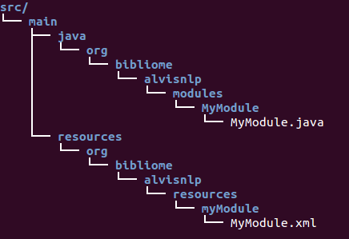

# Create a module
This chapter presents elements and conventions to implement a valid module and to add it to alvisnlp.

The two minimum components to create a module are a **module class** \(a Java Class\) and a **module description** \(a XML file\). The module class contains the implementation of the module and the module description contains the documentation about the module and its parameters. The class file must be present into a source folder \(`src/main/java/*`\) and the description file must be present into a resource folder \(`src/main/resources/*`\), as shown in the example bellow.




## Implement the Module Java Class
As shown in the following Skeleton, the module class extends a Java Class named [`CorpusModule`](### Corpus Class). The main method of the module class is `process` whose arguments are the [`ProcessingContext<Corpus>`](processingcontext) and [`Corpus`](#corpus) objects. The `ProcessingContext<Corpus>` object allows to access the context of the execution i.e. log and system settings. `Corpus` corresponds to the [internal data structure](alvis_internal_data_model.md) of alvisnlp, it contains the main input and output data to be processed by the module. You must implement the task/instructions of the module into the `process` method, by accessing the input data from the  `Corpus` object and writing the outputs into the same `Corpus` object.

> Note that, implementing a module requires to know the [Alvis Internal Data Model](alvis_internal_data_model.md) accessible through the `Corpus` class. If your module uses a special data structure, you have to implement the adapter/converter methods between the module's `specific data structure` and `Corpus.`

For the module to be an valid module, you must use conventional Java annotations, the two principal annotations are `@AlvisNLPModule` and `@Param.` `@AlvisNLPModule` is required for the class to be recognized as a valid module by the alvisnlp system. `@Param` is to allow a class attribute to be recognized as a module parameter. It must annotate each getter method \(and also the setter method\) that get the parameter value \(and also to set the parameter value\) of the module. A detailed presentation of the Java annotation used into alvisnlp are here.

```java
@AlvisNLPModule
public class MyModule extends CorpusModule<ResolvedObjects> {
    private AParamType nameOfAParam;

    @Override
    public void process(ProcessingContext<Corpus> ctx, Corpus corpus) throws ModuleException {
        ...
    }

    @Param
    AParamType getNameOfAParam(){
    ...
    return ...
    }

    @Param
    void setNameOfAParam(AParamType aParamTypeObject){
    ...
    }

    ...
}
```

> Most of the time the module class requires just to extend the [`CorpusModule`](#corpusmodule), however it can extends or implements other interfaces and classes for specific needs \(see here for the details\).


## Declare the Module XML Description
The module description is partially generated from the module Class implementation. By convention, its name corresponds to the name of the module class with the `Doc` string appended \(e.g., for `MyModule.java),`the name of the module description is `MyModuleDoc.xml`\). You must complete the description taking care of providing information needed to understand the module. An example of a module description is available [here](https://github.com/Bibliome/alvisnlp/blob/master/bibliome/src/main/resources/org/bibliome/alvisnlp/modules/compare/CompareElementsDoc.xml).


## Integrate the module source to alvisnlp
We now present how the module is integrated into alvisnlp. First, you must add the module source to the [alvisnlp source here](https://github.com/Bibliome/alvisnlp/tree/master/bibliome/src/main). The module source will be located into a maven project that only contains module libraries. One way to add the module source is to checkout the alvisnlp source and copy the module source as follow.

```shell
$ git clone https://github.com/Bibliome/alvisnlp.git
$ cp -r path_to_the_module_src/ alvisnlp/bibliome/src
```

After the previous step, the module is ready to be packaged with alvisnlp. You have just to compile the `alvisnlp project`.

```shell
$ mvn compile
```

After compilation the module is recognized and packaged into alvisnlp. What happened during compilation? The first thing is recognition of the module and its parameters from the Java annotations. Consistency verification is also done before generation of the module' resources.

<!--  If you went know more about the annotation processor see the AlvisNLPAnnotationProcessor class. The compilation process is configured in the [pom file](https://github.com/Bibliome/alvisnlp/blob/master/bibliome/pom.xml).


[COMMENT]: AlvisNLPAnnotationProcessor -->
