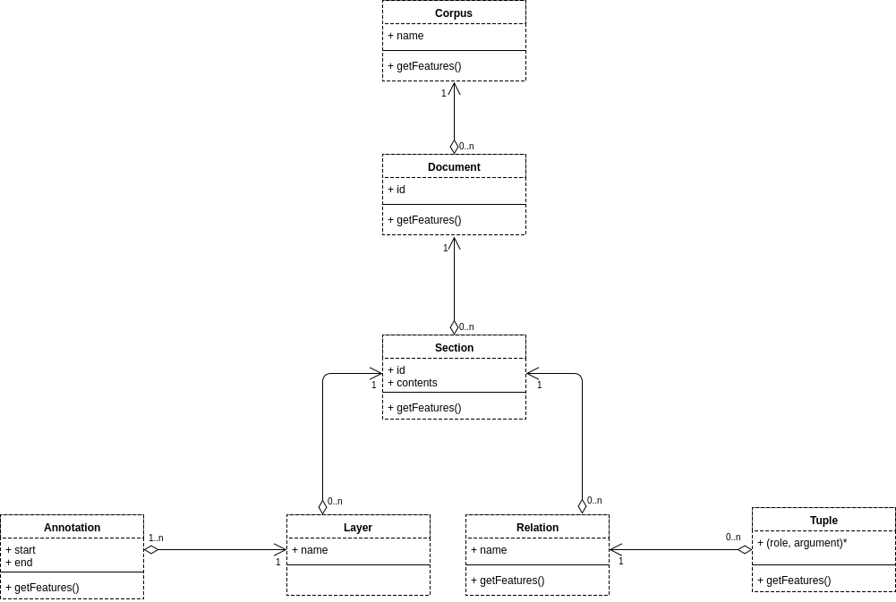

The data structure contains corpus contents and annotation. The data structure is passed from a module to the next one. Each module instance can access (read and write) it through a shared object.

<!--
The data structure provides elements that hold the typical information on   (_Corpus_, _Document_ and _Section_). It also provides elements to contain annotations, events and features (_Annotations_, _Tuples_ and _Features_) and containers consisting of _Layers_ and _Relation_ allow to group information about the elements. 
-->
The following figure presents an UML-like specification of the AlvisNLP/ML data structure.

* **Corpus**: a `Corpus` object represents a collection of documents. In an AlvisNLP/ML run, the corpus is a unique object passed from module to module. A `Corpus` object has *features* and *documents*.

* **Document**: a `Document` object represents a single document. Each document has an identifier which is unique in the corpus. A `Document` object has *features* and *sections*.

* **Section**: a `Section` object contains a piece of the document's text contents. Each section has a *name*, a *contents*, *features*, *layers*, and *relations*.

* **Layer**: a `Layer` object is an *annotation* container. A `Layer` object has a *name* unique in the section.

* **Annotation**: an `Annotation` object represents a span of text created by a module. Each annotation is included in at least one *layer*. An `Annotation` object has a *start* and *end* which represent the coordinates of the annotation in the *section*'s *contents*, and *features*.

* **Relation**: a `Relation` object is a *tuple* container. A `Relation` object has a *name* unique in the section and *features*.

* **Tuple**: a `Tuple` object represents a relation between several elements in the data structure. A `Tuple` object has several *arguments*, each argument is an element (`Corpus`, `Document`, `Section`, `Relation`, but most often `Annotation` or `Tuple`) accessible through a *role* name. A `Tuple` object also has *features*.

* **Features** are key-value pairs that contain information on an element type, tag or property. Feature keys are not unique in an element, though when accessing a feature key, the last value is returned.

